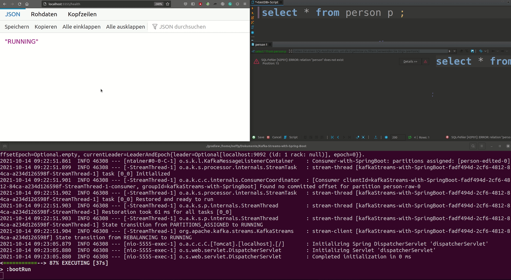

# Kafka Streams with Spring Boot

[![LinkedIn][linkedin-shield]][linkedin-url]

This project serves as a playground for me learning Spring Boot and its components:

Basically, you can produce data via an HTML form under `localhost:5555/person`.

The data is produced to Apache Kafka,
processed by Kafka Streams, and finally consumed again. All Kafka topics are created
programmatically when starting the application. A health route is provided by `localhost:5555/health`.

Moreover, a Avro schema with its registry is used to move the data. 
Here, we set the default configuration `auto.register.schemas` to true, so that
we do not need to register the schema by hand. `http://localhost:8081/subjects` shows the registered schemas.
When working with SpringBoot and JSON serde, there is a good [documentation](https://howtodoinjava.com/kafka/spring-boot-jsonserializer-example/).

Finally, the data is stored in a PostgreSQL database `testDB`.

The topology is tested with a unit test.


## Initialize Project

https://start.spring.io/

### Dependencies:
* Spring Web
* Spring for Apache Kafka Streams
* Spring for Apache Kafka
* Thymeleaf
* PostgreSQL Driver
* Spring Data JPA

## Run Project

Start Kafka broker, Zookeeper, and Schema Registry

```docker-compose up -d```

Run program

```./gradlew bootRun```





## Additional Sources

* [Annotations](http://www.matthiassommer.it/programming/spring-konzepte-annotationen/)
* [PostgreSQL](https://www.bezkoder.com/spring-boot-postgresql-example/)
* [Logging](https://github.com/MicroUtils/kotlin-logging)

### Spring Boot
* [Spring Boot Tutorial](https://spring.io/guides/gs/spring-boot/)
* [HTML form](https://spring.io/guides/gs/handling-form-submission/)
* [Testing](https://reflectoring.io/unit-testing-spring-boot/)
  
### Kafka Streams
* [developer.confluent.io](https://developer.confluent.io/learn-kafka/spring/confluent-cloud/)  
* [Kafka Topics](https://stackoverflow.com/questions/56770412/creating-multiple-kafka-topics-using-spring)
* [Schema Registry](https://docs.confluent.io/platform/current/schema-registry/schema_registry_onprem_tutorial.html#java-consumers)
* [Testing with Avro Schema](https://blog.jdriven.com/2019/12/kafka-streams-topologytestdriver-with-avro/)


[linkedin-shield]: https://img.shields.io/badge/-LinkedIn-black.svg?style=flat-square&logo=linkedin&colorB=555
[linkedin-url]: https://www.linkedin.com/in/patrick-neff-7bb3b21a4/
